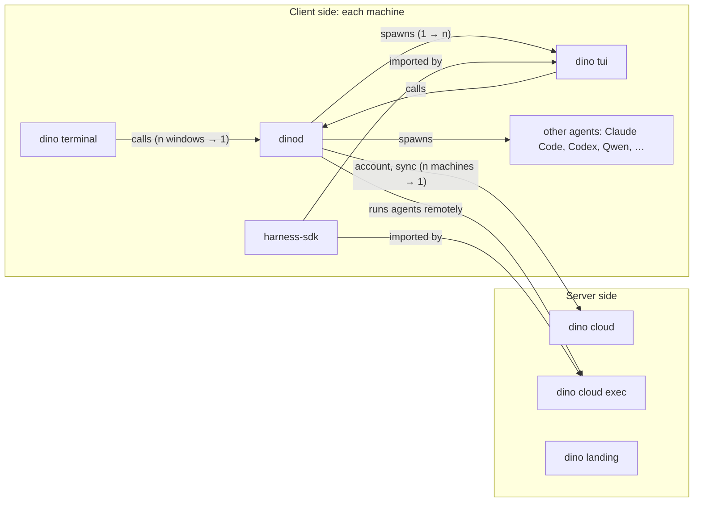

# Architecture

dino is a terminal first: a native terminal on Ghostty's core that also runs, watches and resumes
every coding agent on the machine. Everything is open source except the landing page.

This repository still holds several future repositories in one workspace. They split once their
interfaces settle; until then `crates/boundaries` fails the build if a crate reaches across a line
below.

## Repositories

| Repository | What it is | Today |
|---|---|---|
| **dino-terminal** | The native app: Swift, libghostty, sidebar and panes. A client of dinod over its socket, nothing else. It bundles the `dino` binary. | `app/` |
| **dino** | dinod (sessions, agents, the local proxy, settings, login, sync), the `dino` CLI, and the public crates other repositories build on. | `crates/` |
| **dino-tui** | A full-screen agent TUI on harness-sdk. It runs like any other TUI, with or without dinod or the terminal. | separate repository |
| **harness-sdk** | The agent loop, used by dino-tui and by cloud execution. | separate repository |
| **dino-cloud** | Account, login, settings sync and the account web page. Self-hostable. | `asdf9384/dino-cloud` |
| **dino-cloud-exec** | Optimized remote execution of agents in microVMs/VMs, with an advanced persistence system under it. | not built |
| **dino-landing** | The website. The only private one. | `asdf9384/dino-landing` |

Inside **dino**:

| Crate | Role | May use |
|---|---|---|
| `dino-core` | Settings, the agent adapters, models and compatibility, discovery. Public: dino-tui and dino-cloud build on it. | nothing of ours |
| `dino-sync` | The sync protocol and its end-to-end encryption. Public, and shared with dino-cloud: our encryption claim is checkable because this is open. | `dino-core` |
| `dino-term` | Terminal emulation behind each session. | nothing of ours |
| `dino-router`, `dino-proxy` | The local proxy: per-session routes, metering, the free models pool. It runs inside dinod as a library (no extra hop) and could move to its own repository if cloud execution needs to run it on its own. | `dino-router` |
| `dino-daemon` | dinod, putting it together. | all of the above |
| `dino` | The CLI, a client of dinod. | all of the above |

## How they connect

Remote execution goes through dinod too: dinod is the machine's one client of everything server
side. It holds the dino login, asks dino-cloud-exec for a microVM, and shows the remote session
next to local ones, so the terminal and the TUI never talk to a server themselves. dino-cloud-exec
calls nobody: it only checks that dinod's short-lived token was signed by the account service.

How a session starts: the terminal asks dinod for a session; dinod spawns the agent (dino tui or
any other) in its own pty, with its proxy route, controls and `DINO_SESSION`; the terminal shows it
through `dino attach`. The terminal never spawns an agent itself. A TUI typed by hand into a dino
shell is a process in that shell, which dinod notices and can take over, as with any agent.

## One machine, one dinod

dinod is the only process on a machine that owns the config, the dino login and sync. The
terminal, the CLI and dino-tui are its clients. A client that needs dinod and doesn't find it
starts it in the background (the ssh-agent pattern), so dino-tui works on its own and a TUI inside
the terminal shares the same config, login and sync connection: nothing to reconcile.

Agent traffic goes through the proxy inside dinod and never leaves the machine except to the
provider the agent talks to. dino-cloud only ever sees end-to-end encrypted settings.

## One config, in layers

`~/.config/dino/`, read through `dino-core`, lowest first:

1. Built-in defaults of each product.
2. Account-wide, synced: agents, providers, policies, keys (opt-in), SSH hosts, repo env.
3. Per product, synced: `[terminal]` and `[tui]`; each product reads only its own.
4. This machine only: paths, recent folders, onboarding.
5. Managed by an organisation, over everything.

## Contracts

dino-tui and dino-cloud are built by others against this repository, so these are versioned,
public contracts: dinod's IPC protocol (`dino_core::ipc`), the config schema (`dino_core::settings`)
and the sync protocol (`dino-sync`). Change them compatibly: unknown fields round-trip, new fields
have defaults.

## Splitting later

When the contracts settle: move `app/` to dino-terminal with its history (`git filter-repo`),
building against a pinned dino release; publish the public crates; and if dino-cloud or dino-tui
should not pull all of `dino-core`, carve the settings schema and IPC types into their own small
crates first. `crates/boundaries` is the list to keep honest until then.
