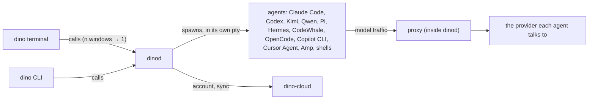

# Architecture

dino is a native terminal on Ghostty's core that also runs, watches and resumes every coding agent
on the machine. This repository holds all of it, the account service included.

| Part | What it is | Where |
|---|---|---|
| **The terminal** | The macOS app: Swift, libghostty, tabs, sidebar and panes. A client of dinod over its socket, nothing else. It bundles the `dino` binary. | `app/` |
| **dinod** | The daemon that owns sessions and agents, the local proxy, settings, the dino login and sync. | `crates/dino-daemon` |
| **`dino`** | The command line, a client of dinod. The same binary runs dinod (`dino daemon`). | `crates/dino` |
| **dino-cloud** | Account, sign-in, settings sync and the account page. Self-hostable. | `cloud/` |

## Crates

| Crate | Role | May use |
|---|---|---|
| `dino-core` | Settings, the agent adapters, models and compatibility, discovery, dinod's IPC types. | nothing of ours |
| `dino-sync` | The sync protocol, shared with dino-cloud, so what leaves the Mac is checkable. | `dino-core` |
| `dino-term` | Terminal emulation behind each session. | nothing of ours |
| `dino-router`, `dino-proxy` | The local proxy: per-session routes, coding plans, fallbacks when a route hits its limit, metering, the free models pool, and noticing an agent's computer or browser use. It runs inside dinod as a library, so there's no extra hop. | `dino-router` |
| `dino-daemon` | dinod, putting it together. | all of the above |
| `dino` | The CLI. It draws no terminal of its own: `dino attach` relays one. | all of the above but `dino-term` |

`crates/boundaries` is a test that fails if a crate reaches across these lines.

`cloud/` is a Cargo workspace of its own: it builds on Linux (dino-core doesn't), pins the Rust
version its host builds with, and keeps the server's dependencies and Postgres tests out of the
terminal's build. It uses `crates/dino-sync` by path, without the `settings` feature, so it never
links dino-core.

## How they connect

How a session starts: the terminal asks dinod for a session. dinod spawns the agent in its own pty,
with its proxy route, controls and `DINO_SESSION`, and the terminal shows it through
`dino attach`. The terminal never spawns an agent itself. Everything a session starts carries its
tag (`DINO_SESSION_TAG`), so what its agent runs in the background, outside its terminal, is still
its own: shown under it, and stopped with it (crates/dino-daemon/src/procs.rs). An agent typed by hand into a dino shell
is that shell's session's agent while it runs: dinod notices it in the shell's foreground and follows
it with the same code as one it started (crates/dino-daemon/src/typed.rs), and starts it again in the
shell, on its conversation, when it restarts. Agents running elsewhere on the Mac (other terminals,
tmux) are found the same way, and *Continue in dino* moves one over.

Each agent has an adapter in `dino-core/src/agent/` that reads its status from the agent's own
signals: its hooks, the log or database it keeps of its turns, or its server; for one that keeps
none of those, its screen. The tool calls dinod reads there also tell it when an agent is using the
computer or a browser.

## One machine, one dinod

dinod is the only process on a machine that owns the config, the dino login and sync. The
terminal and the CLI are its clients. A client that needs dinod and doesn't find it starts it in
the background (the ssh-agent pattern). Agents live in dinod, not in the app: closing or quitting
the app leaves them running, and dinod resumes them after a restart.

With the app installed, launchd runs dinod from the app's launch agent (SMAppService), so dinod and
everything it starts count as the app for macOS privacy permissions (Screen Recording,
Accessibility…), whoever asked for it to start. A client starts it with `launchctl kickstart`
(crates/dino/src/launchd.rs, app/Sources/Dino/LaunchAgent.swift). Without the app it is forked as
before.

Builds share one compiler cache per machine. dinod starts every local session (agents and shells)
with `RUSTC_WRAPPER` set to a script of its own that runs rustc through sccache, and runs the one
sccache server, on its own socket, while sessions use it. Each worktree keeps its own `target/`. A
missing, broken or full cache falls back to plain rustc; a wrapper the repo or the user set up wins
(crates/dino-core/src/build_cache.rs).

Claude Code's and Codex's traffic, and any agent's on a provider route, goes through the proxy
inside dinod (unless routing is turned off) and never leaves the machine except to the provider the
agent talks to. dino-cloud sees only synced settings (over TLS, readable by the
service so the account page can show them); API keys and tokens never leave the Mac.
Usage statistics (`dino stats`, the Stats window) live in `stats.db` in dino's config folder:
the proxy's per-call records, written by dinod in batches, and what agents' own transcripts say,
read when asked or when a session ends. They are never synced.

## One config, in layers

`~/.config/dino/` (or `$DINO_HOME`), read through `dino-core`, lowest first:

1. Built-in defaults.
2. Account-wide, synced (`crates/dino-sync/src/settings.rs`): routing, policies, each agent's
   mode, model and effort, worktree options, fallback chains, SSH hosts, repo variables (by git
   remote), `[terminal]` and `[tmux]`. API keys and tokens never sync.
3. This machine only: paths, recent folders, onboarding, experiments.
4. Managed by an organisation, over everything.

## Contracts

Other programs build against this repository, so these are versioned, public contracts: dinod's
IPC protocol (`dino_core::ipc`), the config schema (`dino_core::settings`) and the sync protocol
(`dino-sync`). Change them compatibly: unknown fields round-trip, new fields have defaults.
