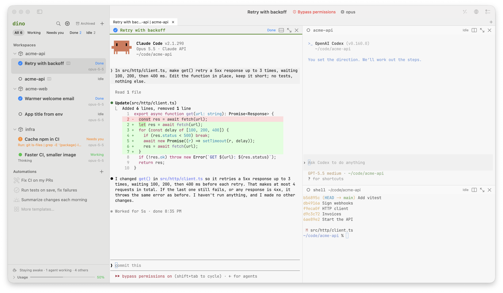

<h1 align="center">dino</h1>

<p align="center"><strong>Every agent, one terminal.</strong></p>

<p align="center">
  <a href="LICENSE"></a>
  <a href="https://github.com/meetdino/dino-releases/releases/latest"></a>
  
</p>

<p align="center">
  <a href="#install">Install</a> ·
  <a href="#features">Features</a> ·
  <a href="#supported-agents">Agents</a> ·
  <a href="#building-from-source">Build</a> ·
  <a href="ARCHITECTURE.md">Architecture</a> ·
  <a href="CONTRIBUTING.md">Contributing</a>
</p>

<p align="center">
  <picture>
    <source media="(prefers-color-scheme: dark)" srcset="docs/images/screenshot-dark.png">
    
  </picture>
</p>

dino is a native Mac terminal on Ghostty's core. It finds Claude Code, Codex and the rest wherever
they run on your Mac, keeps them going after you quit, and tells you when one needs you. Close the
sidebar and it's a plain terminal. Free and open source, no account.

## Install

macOS 14 or later, on Apple silicon.

```sh
brew install meetdino/tap/dino
```

Or download [Dino.dmg](https://github.com/meetdino/dino-releases/releases/latest/download/Dino.dmg).
Both include the `dino` command. For just the command line:

```sh
curl -fsSL https://meetdino.com/install.sh | sh
```

dino updates itself.

## Features

- **Finds the agents you already have.** Agents running in iTerm2, Terminal, Ghostty or tmux show
  up in the sidebar with what they're doing. *Continue in dino* brings one over, conversation
  included.
- **Agents outlive the window.** A background daemon, `dinod`, owns every session. Quit the app,
  or restart dinod, and they're still there; `dino ls` lists them from any terminal.
- **Knows which one needs you.** Working, needs you, done or idle, from each agent's own signals,
  with a notification and a Dock badge when one is waiting on you.
- **A real terminal.** Tabs, splits, your Ghostty config, themes and keybinds. Your own tmux runs
  untouched, and *Show my agents in tmux* puts dino's agents in a tmux session as windows.
- **An AI line in your shell.** <kbd>⌘I</kbd> turns plain English into a command you can check
  before it runs. <kbd>⌘⏎</kbd> hands a bigger request to an agent in a split.
- **A browser for every session.** When an agent starts a dev server, dino offers its page in a
  preview beside the terminal, which keeps its page as you switch sessions.
- **From diff to merged.** A session per git worktree. Comment on lines of its diff and send them
  to the agent, then open the pull request with auto-fix (failed checks go back to the agent with
  their logs) and auto-merge.
- **Any agent, any model.** Use each agent's own login, or run it through dino's local proxy on
  OpenRouter, your ChatGPT plan, a coding plan's key, or a model on your Mac with Ollama, LM
  Studio, llama.cpp or vLLM. Every session shows its model, tokens and context.
- **Keeps going at a limit.** When a subscription or plan runs out, the next call goes on to the
  routes you list for that agent (another plan, OpenRouter, a model on your Mac) until the limit
  resets, and the session says so.
- **Automations.** Start or continue an agent on a schedule, when a PR opens or merges, CI fails or
  someone writes @dino, when files change, or after another run. Start from a ready one (fix CI on
  my PRs, review new PRs, run tests on save) and adjust it. Each run keeps its summary, its diff
  and its PR.
- **Usage across every agent.** Tokens, models, streaks, speed per provider and what each session
  costs your Mac, from dino's proxy and each agent's own records.
- **Shows when an agent uses your Mac.** When an agent drives your apps or your browser through
  computer use, its session says so, with a Stop button.
- **Nothing leaves your Mac** except each agent's traffic to the provider it talks to. Signing in
  is optional, only to sync settings between Macs, and API keys never sync.

## Supported agents

dino finds, starts, resumes and tracks the status of
[Claude Code](https://github.com/anthropics/claude-code),
[Codex](https://github.com/openai/codex),
[GitHub Copilot CLI](https://github.com/github/copilot-cli),
[Cursor Agent](https://cursor.com/docs/cli/overview),
[Amp](https://ampcode.com),
[OpenCode](https://opencode.ai),
[Kimi Code](https://moonshotai.github.io/kimi-code/en/),
[Qwen Code](https://github.com/QwenLM/qwen-code),
[Pi](https://pi.dev),
[Hermes Agent](https://github.com/NousResearch/hermes-agent) and
[CodeWhale](https://github.com/Hmbown/CodeWhale), and your shells.

It also starts [Crush](https://github.com/charmbracelet/crush) and [Aider](https://aider.chat),
without status. Settings shows which agents are installed, and installs or signs in to the rest
with each agent's own commands.

## Using the command line

```sh
dino                      # the app; in a dino terminal or piped, the sessions
dino .                    # a shell in this folder, shown in the app
dino . claude             # Claude Code in this folder
dino ls                   # every session
dino attach <id>          # a session in this terminal
dino found                # agents running elsewhere on this Mac
dino stats                # usage across every agent: tokens, models, streaks
dino automations          # what dino does by itself, and how each run went
dino --help               # the rest
```

Settings live in `~/.config/dino/settings.toml`, which `dinod` reads and writes. The app's
Settings window edits the same file.

## Building from source

You need the Xcode Command Line Tools (`xcode-select --install`) and Rust
([rustup](https://rustup.rs), 1.85 or later). No Apple developer account or signing keys.

```sh
git clone https://github.com/meetdino/dino.git
cd dino
cargo build --release      # the dino command and dinod: target/release/dino
./app/build.sh --install   # Dino.app with both inside: ~/Applications/Dino.app
open ~/Applications/Dino.app
```

That's the dino to use every day: it runs dinod from the `dino` inside it, as a release does, and
moves dinod over to a new build once nothing is working. Run `./app/build.sh --install` again after
pulling (while dino runs, the new build waits beside it), then choose Restart to Update in dino. dino →
Install Command Line Tool links `~/.local/bin/dino` to the `dino` inside it. Builds are signed
with your Developer ID if the keychain has one (macOS then keeps dino's permissions from one build
to the next), ad hoc otherwise.

`./app/build.sh` alone makes `app/build/Dino.app`, "dino dev": a build to try things in, with its
own settings and permissions, that runs the `dino` on your `PATH`.

To try a build without touching the dino you use every day, give it its own home, and it runs its
own `dinod` there:

```sh
DINO_HOME=/tmp/dino-dev ./target/release/dino new shell
```

## How it's built

- `dinod` (Rust) owns sessions, the local proxy, settings and sign-in. Everything else is a client
  of it over a Unix socket.
- The app (Swift, SwiftUI) draws terminals with [libghostty](https://github.com/Lakr233/libghostty-spm).
- `dino` (Rust) is the command line, and `dinod` itself.
- `cloud/` is the optional account server (Rust, Postgres) for sign-in and settings sync. You can
  host your own: see [cloud/README.md](cloud/README.md).

[ARCHITECTURE.md](ARCHITECTURE.md) has the whole picture: the crates, how they may depend on each
other, and the contracts other projects build on.

## Contributing

Issues and pull requests are welcome. [CONTRIBUTING.md](CONTRIBUTING.md) covers setup, testing
without disturbing your own dino, the performance budget, and signing off your commits (DCO).
Everyone taking part follows the [Code of Conduct](CODE_OF_CONDUCT.md). Please report security
issues privately, as [SECURITY.md](SECURITY.md) describes.

## License

MIT, see [LICENSE](LICENSE). Third-party code dino includes, and its licenses, are listed in
[THIRD_PARTY_NOTICES.md](THIRD_PARTY_NOTICES.md), and the account server's in
[cloud/THIRD_PARTY_NOTICES.md](cloud/THIRD_PARTY_NOTICES.md).
